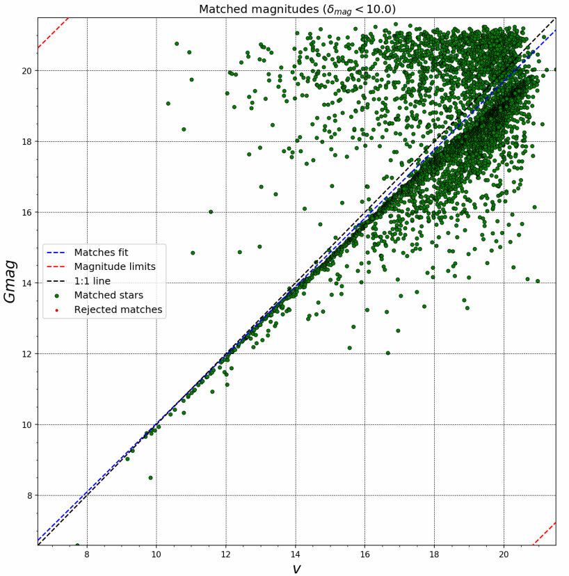

# Four clusters around TR24

Analysis of four clusters located around Trumpler 24: Lynga13, Lynga14, NGC6192, NGC6242

<!-- MarkdownTOC levels="1,2" autolink="true" style="ordered" -->

1. [Cleaning](#cleaning)
1. [Cross match with Gaia DR2](#cross-match-with-gaia-dr2)
1. [LYNGA13](#lynga13)
1. [LYNGA14](#lynga14)
1. [NGC6192](#ngc6192)
1. [NGC6242](#ngc6242)

<!-- /MarkdownTOC -->

## Cleaning

Cleaned the NGC6242 file (lots of '0' values instead of INDEFs for UB, plus there were extra unidentified columns and rows). The 'alpha' row in this cluster is in hours, not degrees.

Also cleaned the remaining files, mainly from INDEFs

## Cross match with Gaia DR2
Used the `catalog_match` script to cross-match with Gaia DR2 data. The match tolerance used is 10 arcsec, and the magnitude difference cut is turned off.

There is substantial dispersion in the V versus G magnitude of matched stars, as seen here for NGC6242:

## LYNGA13

Center Ruben  : 252.2208333,-43.4333333 <-- (16:48:53,-43:26:00)
Center Aladin : 252.2330000,-43.427999

### Structural analysis
There is no evident overdensity in (ra, dec) so the center is manually fixed. The radius is estimated by ASteCA to be ~6.2 arcmin.

There are between 200-400 members in the observed frame, for this selected cluster region.

### Analysis of CMDs
The V vs BV CMD show a clear overdensity resembling a main sequence. Could be just an artifact due to the variable extinction in the area.

### Analysis of PMs
No evident overdensity in the PMs space.

### Analysis of Plx
No evident overdensity in the Plx space.

## LYNGA14

Center Ruben  : 253.7641667,-45.2358611 <-- (16:55:03.40,-45:14:09.1)
Center Aladin : 253.7480000,-45.239999

### Structural analysis
The field shows a large and spread out overdensity in the northern portion of the frame. There is no noticeable overdensity at the center coordinates. The radius estimated by ASteCA at the manually fixed center coordinates is smaller than 1 arcmin.

The number of members in the frame is unclear as a cluster region can not be determined. From PMs analysis it can be approximated to ~70

### Analysis of CMDs
There is no clear sequence in the V vs BV diagram, before or after selecting those stars in the PMS overdensity.

### Analysis of PMs
There is a clear overdensity in the PMS space centered at $(\mu_{\alpha} cos{\delta}, \mu_{\delta}) = (-0.36, -1.93) [mas/yr]$. Stars in this overdensity cover the entire range of coordinates (i.e.: are not spatially clustered in our observed frame).

### Analysis of Plx
The stars in the PM overdensity seem to cluster around ~0.4 [mas], but with considerable scatter.

## NGC6192

Center Ruben  : 250.0683333,-43.5086111 <-- (16:40:16.40,-43:30:31.0)
Center Aladin : 250.0958333,-43.366666

### Structural analysis
Very clear overdensity with ~150 estimated members. The radius is estimated around ~3.7 arcmin.

### Analysis of CMDs
Very clear sequence with a TO point at V~12 mag.

### Analysis of PMs
Very clear overdensity in PMs, centered at $(\mu_{\alpha} cos{\delta}, \mu_{\delta}) = (1.64, -0.26) [mas/yr]$

### Analysis of Plx
Clear grouping around ~0.6 mas.

## NGC6242

Center Ruben  : 253.8849167,-39.4672222 <-- (16:55:32.38,-39:28:02.0)
Center Aladin : 253.9000000,-39.466666

### Structural analysis
There seem to be two or three separate overdensities in the frame, but this is likely an artifact due to the presence of dust. The center is manually fixed, and the estimated radius is ~4.5 arcmin.

The estimated number of members in the cluster region is between 500-700.

### Analysis of CMDs
There is a distinct sequence in the V vs BV diagram, but it also shows in the fields surrounding the cluster region. This could be due to an underestimated radius for the cluster region.

### Analysis of PMs
The PMs analysis confirms that the cluster region obtained through structural analysis is not correct. There is a very clear overdensity in the PMs space, centered at
$(\mu_{\alpha} cos{\delta}, \mu_{\delta}) = (1.08, -0.90) [mas/yr]$. The coordinates of stars in this overdensity are distributed across the entire observed frame.

### Analysis of Plx
Clear grouping around ~0.75 mas.